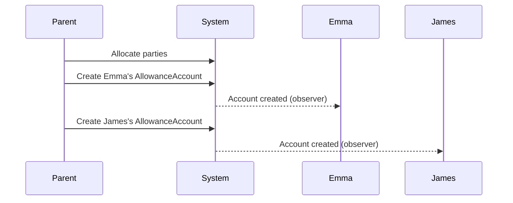
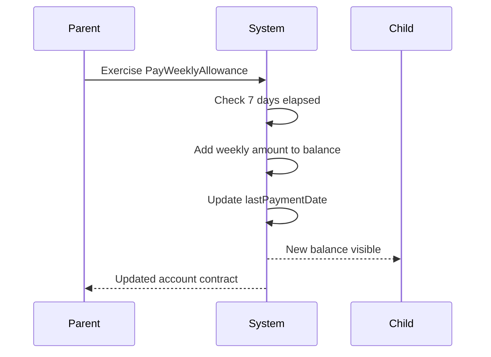
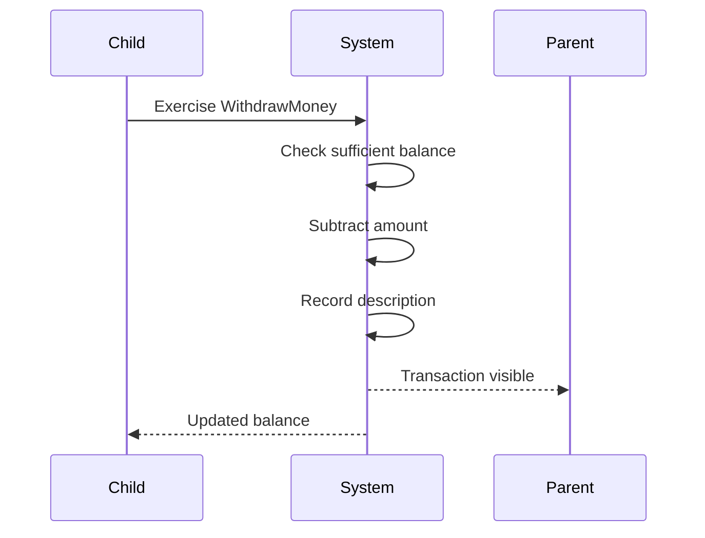
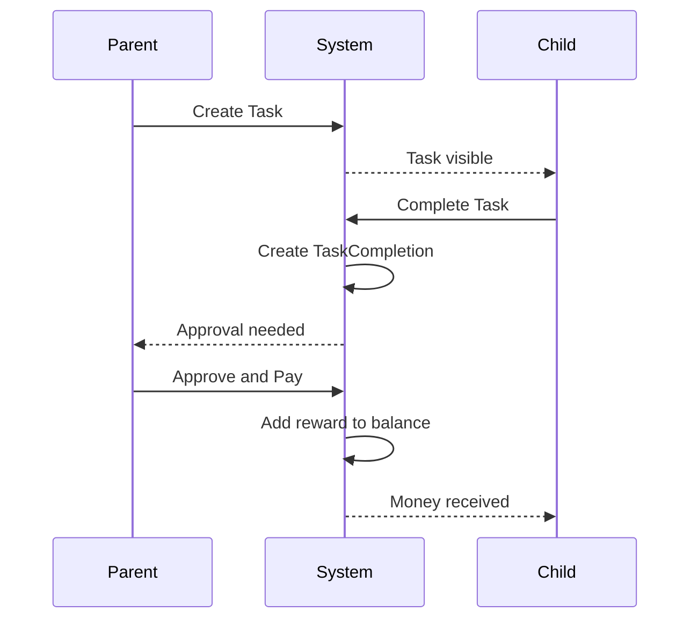
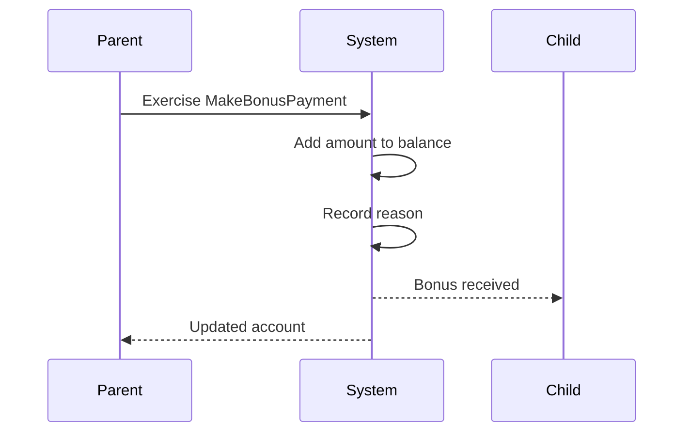

# Workflow Documentation

Detailed workflows for the Kids Allowance Management System.

## Table of Contents

1. [Setup and Initialization](#setup-and-initialization)
2. [Weekly Allowance Payment](#weekly-allowance-payment)
3. [Child Withdrawal](#child-withdrawal)
4. [Task Creation and Completion](#task-creation-and-completion)
5. [Bonus Payments](#bonus-payments)
6. [Balance Adjustments](#balance-adjustments)
7. [Complete Family Workflow](#complete-family-workflow)

---

## Setup and Initialization

### Business Intent

Set up allowance accounts for Emma and James with initial balances and weekly allowance amounts.

### Participants

- **Parent**: Controls the allowance system
- **Emma**: First child receiving allowance
- **James**: Second child receiving allowance

### Workflow Steps



### DAML Script

```daml
setupAllowanceSystem : Script (Parties, [ContractId AllowanceAccount])
setupAllowanceSystem = do
  -- Create parties
  parent <- allocateParty "Parent"
  emma <- allocateParty "Emma"
  james <- allocateParty "James"

  -- Set initial date
  let startDate = date 2025 Nov 27

  -- Create Emma's account: $20 balance, $10/week
  emmaAccount <- submit parent do
    createCmd AllowanceAccount with
      parent; child = emma; childName = "Emma"
      balance = 20.0; weeklyAmount = 10.0
      lastPaymentDate = startDate; currency = "USD"

  -- Create James's account: $15 balance, $8/week
  jamesAccount <- submit parent do
    createCmd AllowanceAccount with
      parent; child = james; childName = "James"
      balance = 15.0; weeklyAmount = 8.0
      lastPaymentDate = startDate; currency = "USD"

  return (parties, [emmaAccount, jamesAccount])
```

### Result

- Emma: $20 starting balance, $10 weekly allowance
- James: $15 starting balance, $8 weekly allowance
- Both children can observe their accounts
- Parent controls both accounts

---

## Weekly Allowance Payment

### Business Intent

Parent pays the weekly allowance to a child. System enforces a 7-day minimum between payments.

### Preconditions

- AllowanceAccount exists for the child
- At least 7 days have passed since last payment

### Workflow Steps



### DAML Code

```daml
choice PayWeeklyAllowance : ContractId AllowanceAccount
  with
    today : Date
  controller parent
  do
    let daysSincePayment = subDate today lastPaymentDate
    assertMsg "Must wait at least 7 days" (daysSincePayment >= 7)
    
    create this with
      balance = balance + weeklyAmount
      lastPaymentDate = today
```

### Example Usage

```daml
-- 7 days after account creation
let nextWeek = date 2025 Dec 4

newEmmaAccount <- submit parent do
  exerciseCmd emmaAccountCid PayWeeklyAllowance with
    today = nextWeek

-- Emma's balance increases from $20 to $30
```

### Business Rules

1. **7-Day Minimum**: Prevents double-payment within same week
2. **Automatic Addition**: Weekly amount added to current balance
3. **Date Tracking**: Updates lastPaymentDate for next week's calculation
4. **No Limit**: Balance can grow indefinitely (encourages saving)

---

## Child Withdrawal

### Business Intent

Child withdraws money from their allowance account when they spend it. Requires sufficient balance.

### Preconditions

- Child has an active AllowanceAccount
- Balance >= withdrawal amount

### Workflow Steps



### DAML Code

```daml
choice WithdrawMoney : ContractId AllowanceAccount
  with
    amount : Decimal
    description : Text
  controller child
  do
    assertMsg "Withdrawal must be positive" (amount > 0.0)
    assertMsg "Insufficient balance" (balance >= amount)
    
    create this with
      balance = balance - amount
```

### Example Usage

```daml
-- Emma withdraws $5 to buy a book
newEmmaAccount <- submit emma do
  exerciseCmd emmaAccountCid WithdrawMoney with
    amount = 5.0
    description = "Bought a book"

-- Emma's balance decreases by $5
```

### Business Rules

1. **Child Control**: Only the child can withdraw their own money
2. **Sufficient Balance**: Cannot overdraw the account
3. **Transparency**: Parent can see what money was spent on
4. **Positive Amounts**: Cannot withdraw negative or zero amounts

### Real-World Usage

This choice would be exercised when:
- Child buys something and reports it
- Parent enters the transaction on child's behalf
- Mobile app records automatic transactions

---

## Task Creation and Completion

### Business Intent

Parents create tasks (chores) that children can complete to earn extra money beyond their weekly allowance.

### Workflow Overview



### Step 1: Create Task

```daml
-- Parent creates a task for James
task <- submit parent do
  createCmd Task with
    parent; child = james; childName = "James"
    description = "Clean the garage"
    reward = 5.0
    dueDate = Some (date 2025 Dec 1)
    currency = "USD"
```

**Result**: Task contract created, visible to James

### Step 2: Child Completes Task

```daml
-- James marks the task as complete
taskCompletion <- submit james do
  exerciseCmd task CompleteTask with
    completionDate = date 2025 Nov 30
```

**Result**: 
- Original Task contract consumed
- TaskCompletion contract created
- Awaiting parent approval

### Step 3: Parent Approves and Pays

```daml
-- Parent reviews and approves
newJamesAccount <- submit parent do
  exerciseCmd taskCompletion ApproveAndPay with
    allowanceAccountCid = jamesAccountCid
```

**Result**:
- TaskCompletion archived
- Reward added to James's balance
- James's AllowanceAccount updated

### Alternative: Reject Completion

```daml
-- If task wasn't done properly
submit parent do
  exerciseCmd taskCompletion RejectCompletion with
    reason = "Garage still messy, please finish"
```

**Result**: TaskCompletion archived, no payment made

### Business Rules

1. **Two-Step Process**: Child claims completion, parent must approve
2. **Transparency**: All parties see task status
3. **Optional Deadlines**: Tasks can have due dates or be ongoing
4. **Cancellation**: Parent can cancel tasks before completion
5. **Linked Payment**: Reward goes directly to child's allowance account

---

## Bonus Payments

### Business Intent

Parent makes one-time payments for special occasions (birthdays, achievements, etc.) outside of regular allowance.

### Workflow



### DAML Code

```daml
choice MakeBonusPayment : ContractId AllowanceAccount
  with
    amount : Decimal
    reason : Text
  controller parent
  do
    assertMsg "Amount must be positive" (amount > 0.0)
    create this with
      balance = balance + amount
```

### Example Usage

```daml
-- Birthday bonus for Emma
newEmmaAccount <- submit parent do
  exerciseCmd emmaAccountCid MakeBonusPayment with
    amount = 25.0
    reason = "Birthday gift"
```

### Common Use Cases

- **Birthdays**: Special birthday money
- **Holidays**: Christmas, Hanukkah, etc.
- **Academic Achievement**: Good grades, honor roll
- **Special Occasions**: Tooth fairy, graduation
- **Random Acts**: Unexpected kindness, helping others
- **Compensation**: Lost money found/returned

### Business Rules

1. **Parent Control**: Only parent can make bonus payments
2. **Documented Reasons**: Each payment has an explanation
3. **Unrestricted**: No limits on amount or frequency
4. **Independent**: Doesn't affect weekly allowance or lastPaymentDate

---

## Balance Adjustments

### Adjust Weekly Allowance Amount

**Business Intent**: Change the weekly allowance amount (raise or lower based on age, responsibilities, etc.)

```daml
choice AdjustWeeklyAmount : ContractId AllowanceAccount
  with
    newAmount : Decimal
  controller parent
  do
    assertMsg "Amount must be positive" (newAmount > 0.0)
    create this with
      weeklyAmount = newAmount
```

**Example**:
```daml
-- Emma is older now, increase allowance
newEmmaAccount <- submit parent do
  exerciseCmd emmaAccountCid AdjustWeeklyAmount with
    newAmount = 12.0  -- Increased from $10 to $12
```

### Add Funds (Correction)

**Business Intent**: Add money without it being a bonus or weekly payment (e.g., correcting a mistake)

```daml
choice AddFunds : ContractId AllowanceAccount
  with
    amount : Decimal
  controller parent
  do
    assertMsg "Amount must be positive" (amount > 0.0)
    create this with
      balance = balance + amount
```

### View Balance (Non-Consuming)

**Business Intent**: Check current balance without modifying the contract

```daml
nonconsuming choice ViewBalance : (Text, Decimal)
  controller parent
  do
    return (childName, balance)
```

**Example**:
```daml
(name, balance) <- submit parent do
  exerciseCmd emmaAccountCid ViewBalance

debug $ name <> "'s balance: $" <> show balance
-- Output: Emma's balance: $35.0
```

---

## Complete Family Workflow

### Real-World Scenario

A typical month in the life of the allowance system.

### Timeline

#### Week 1 (Setup)

```daml
-- November 27: Initialize system
(parties, accounts) <- setupAllowanceSystem

-- Initial state:
-- Emma: $20 balance, $10/week
-- James: $15 balance, $8/week
```

#### Week 2 (First Payments)

```daml
-- December 4: Pay weekly allowances
let week2Date = date 2025 Dec 4

emmaAccount1 <- submit parent do
  exerciseCmd emmaAccountCid PayWeeklyAllowance with today = week2Date
-- Emma: $30 balance

jamesAccount1 <- submit parent do
  exerciseCmd jamesAccountCid PayWeeklyAllowance with today = week2Date
-- James: $23 balance
```

#### Week 2 (Activity)

```daml
-- December 5: Emma buys a toy
emmaAccount2 <- submit emma do
  exerciseCmd emmaAccount1 WithdrawMoney with
    amount = 15.0
    description = "New toy"
-- Emma: $15 balance

-- December 6: Parent creates task for James
task <- submit parent do
  createCmd Task with
    parent; child = james; childName = "James"
    description = "Wash the car"
    reward = 7.0
    dueDate = Some (date 2025 Dec 10)
    currency = "USD"
```

#### Week 3 (Task Completion)

```daml
-- December 8: James completes task
taskCompletion <- submit james do
  exerciseCmd task CompleteTask with
    completionDate = date 2025 Dec 8

-- December 9: Parent approves
jamesAccount2 <- submit parent do
  exerciseCmd taskCompletion ApproveAndPay with
    allowanceAccountCid = jamesAccount1
-- James: $30 balance ($23 + $7)
```

#### Week 3 (Special Event)

```daml
-- December 10: Emma's birthday
emmaAccount3 <- submit parent do
  exerciseCmd emmaAccount2 MakeBonusPayment with
    amount = 25.0
    reason = "Birthday gift"
-- Emma: $40 balance ($15 + $25)
```

#### Week 4 (Next Payment)

```daml
-- December 11: Pay weekly allowances again
let week4Date = date 2025 Dec 11

emmaAccount4 <- submit parent do
  exerciseCmd emmaAccount3 PayWeeklyAllowance with today = week4Date
-- Emma: $50 balance ($40 + $10)

jamesAccount3 <- submit parent do
  exerciseCmd jamesAccount2 PayWeeklyAllowance with today = week4Date
-- James: $38 balance ($30 + $8)
```

### Final State

After one month:

- **Emma**: Started with $20, now has $50
  - 2 weekly payments: +$20
  - Bought toy: -$15
  - Birthday bonus: +$25

- **James**: Started with $15, now has $38
  - 2 weekly payments: +$16
  - Completed task: +$7

### Business Insights

This workflow demonstrates:

1. **Predictable Income**: Regular weekly allowances
2. **Financial Responsibility**: Emma saved most of her allowance even after buying a toy
3. **Work Rewards**: James earned extra by completing chores
4. **Special Occasions**: System handles one-time events
5. **Transparency**: All transactions recorded and traceable
6. **Parental Control**: Parent maintains oversight throughout

---

## Integration Patterns

### Mobile App Integration

For building a mobile app on top of this system:

1. **Parent View**:
   - Query all AllowanceAccount contracts
   - Display balances for all children
   - Buttons for: Pay Allowance, Add Bonus, Create Task

2. **Child View**:
   - Query their own AllowanceAccount
   - See current balance
   - View available Tasks
   - Button to mark task complete
   - Form to record withdrawal

3. **Notifications**:
   - Alert parent when task completed
   - Alert child when payment received
   - Remind parent on weekly allowance day

### Web Dashboard

For a family dashboard:

```typescript
// Fetch all accounts
const accounts = await ledger.query(AllowanceAccount);

// Display summary
accounts.forEach(account => {
  console.log(`${account.childName}: $${account.balance}`);
});

// Show pending tasks
const tasks = await ledger.query(Task);
const completions = await ledger.query(TaskCompletion);
```

### Scheduled Automation

Automate weekly payments:

```python
import schedule
from datetime import date

def pay_weekly_allowances():
    # Query all accounts
    accounts = client.find_active('Allowance:AllowanceAccount')
    
    for cid, account in accounts:
        # Check if 7 days passed
        # Exercise PayWeeklyAllowance
        pass

# Run every Sunday at 9 AM
schedule.every().sunday.at("09:00").do(pay_weekly_allowances)
```

---

## Business Considerations

### Education Value

This system teaches children:

- **Saving**: Balance accumulates over time
- **Budgeting**: Plan purchases based on available funds
- **Work Ethic**: Tasks earn extra money
- **Delayed Gratification**: Save for bigger purchases
- **Transparency**: See complete financial history

### Parental Benefits

Parents get:

- **Automation**: Set-and-forget weekly payments
- **Oversight**: See all transactions
- **Flexibility**: Adjust amounts as needed
- **Fairness**: Blockchain ensures accuracy
- **History**: Complete audit trail

### Future Extensions

Could be extended to support:

- **Savings Goals**: Set targets with progress tracking
- **Interest**: Reward long-term saving
- **Spending Categories**: Track where money goes
- **Shared Family Contracts**: Family activities and rewards
- **Peer Transfers**: Kids can gift each other
- **Investment Simulation**: Teach basic investing concepts

---

**This workflow documentation provides a complete understanding of how the allowance system operates in real-world scenarios.**

